官网: https://www.sourcetreeapp.com/

## 1. 下载&安装

**下载：**

官网下载： [https://www.sourcetreeapp.com/](https://www.sourcetreeapp.com/)

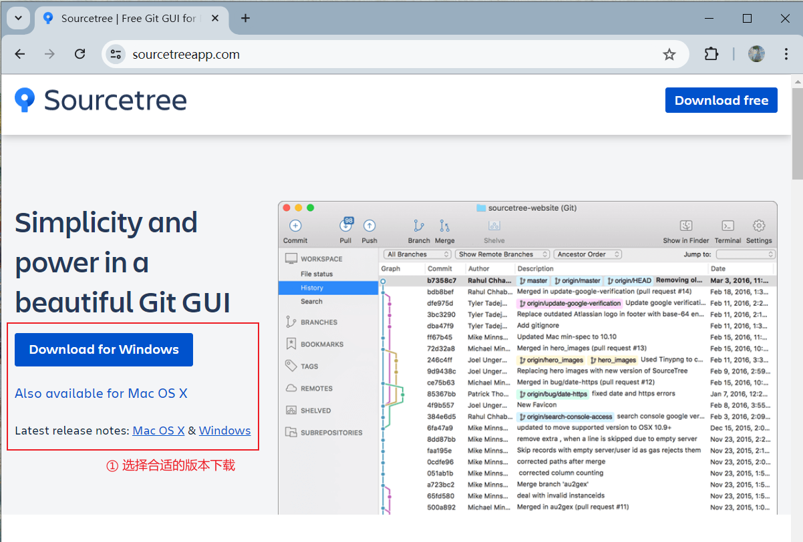

**安装：**

自信跳过广告

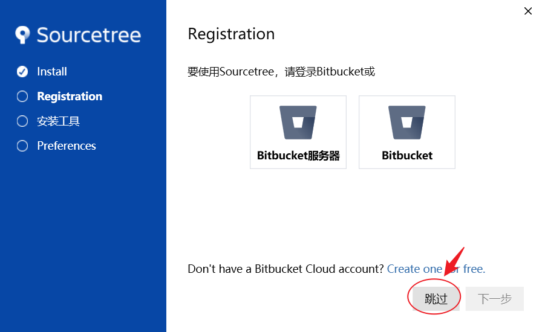

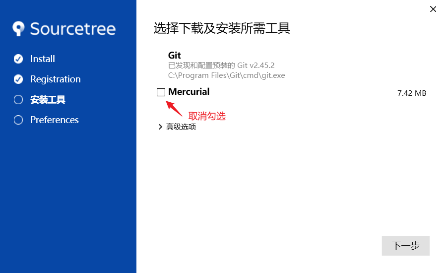

设置全局用户名/邮箱

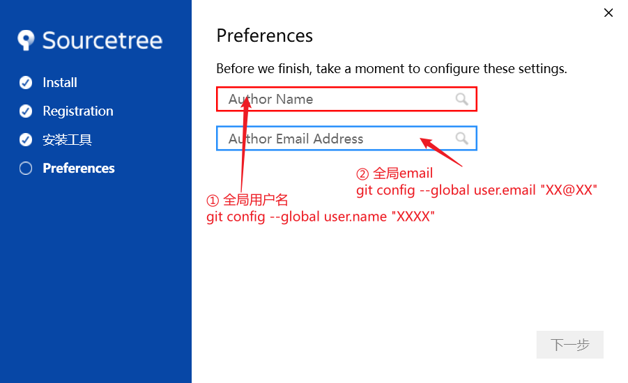

可以暂时不设SSH密钥

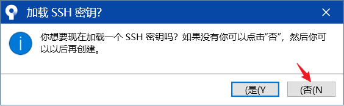

安装完成界面：

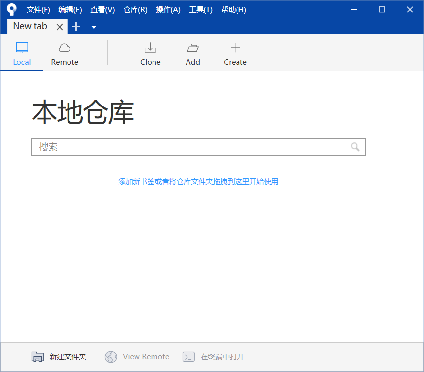

## 2. 管理仓库

### 2.1 新建仓库

1. 在服务器端新建仓库
2. 在服务器端复制仓库HTTP地址

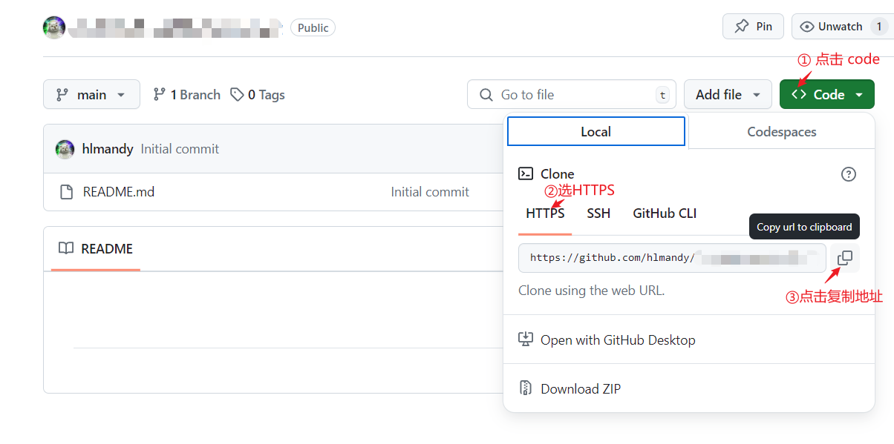

3. 克隆到本地

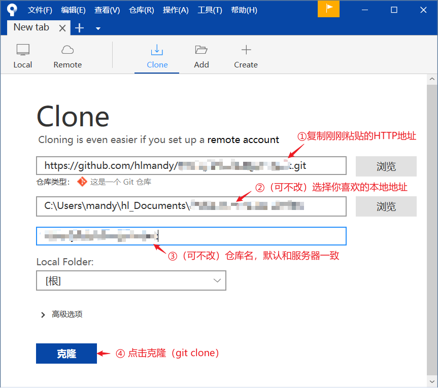

### 2.2 打开现有仓库

打开本地仓库文件夹，如果是git仓库，会识别为Git仓库

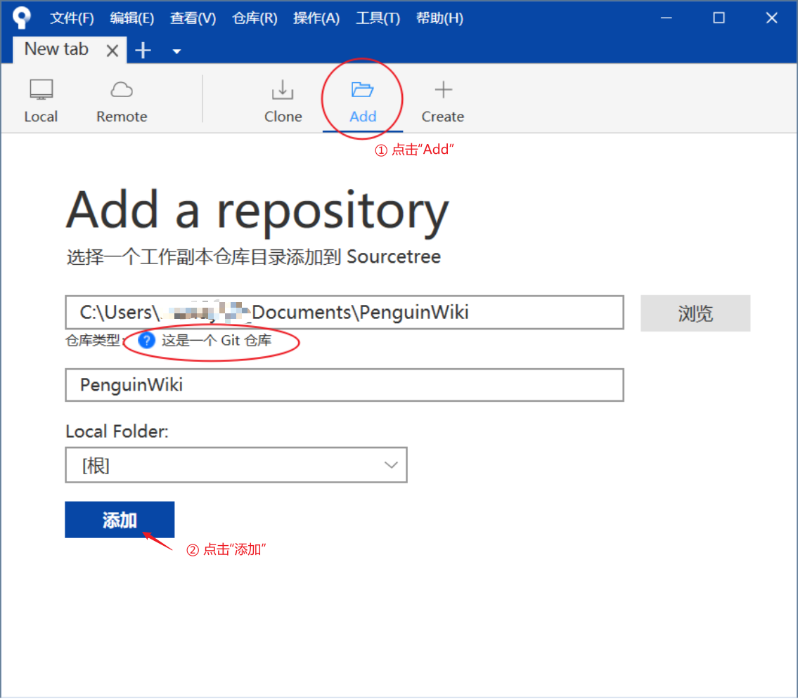

## 3. 更改仓库

### 3.1 push

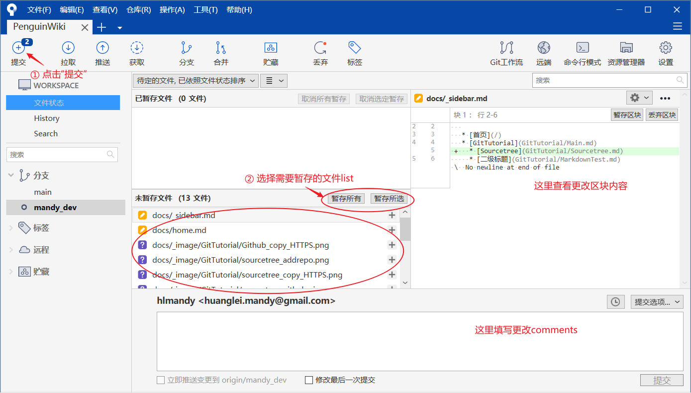

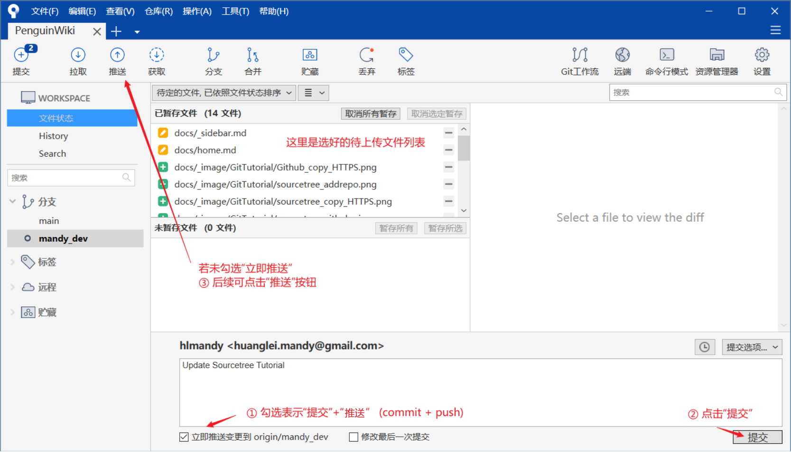

如果说需要登录账户，就自信登录！（这里是github）

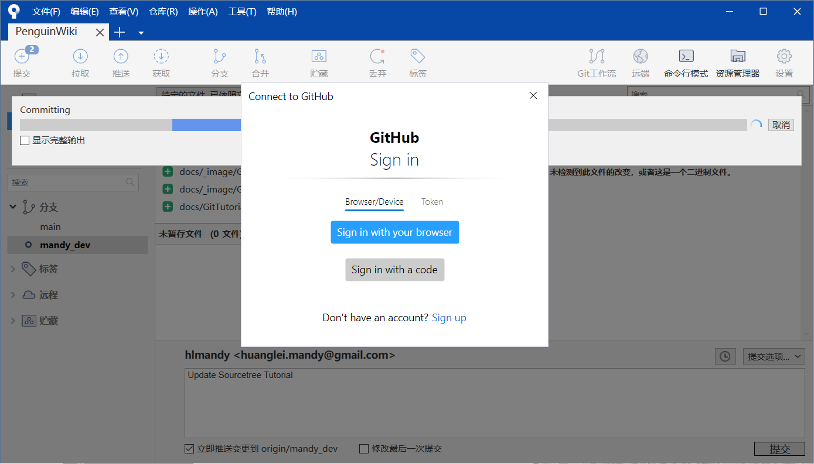

登录完之后，Sourcetree会给你贴心地存起来，在这里：

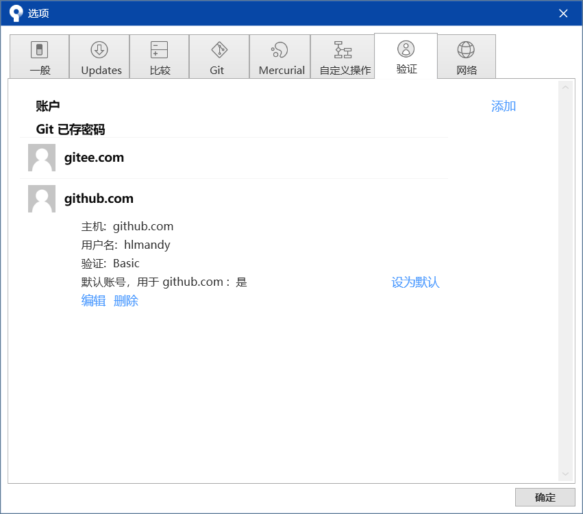