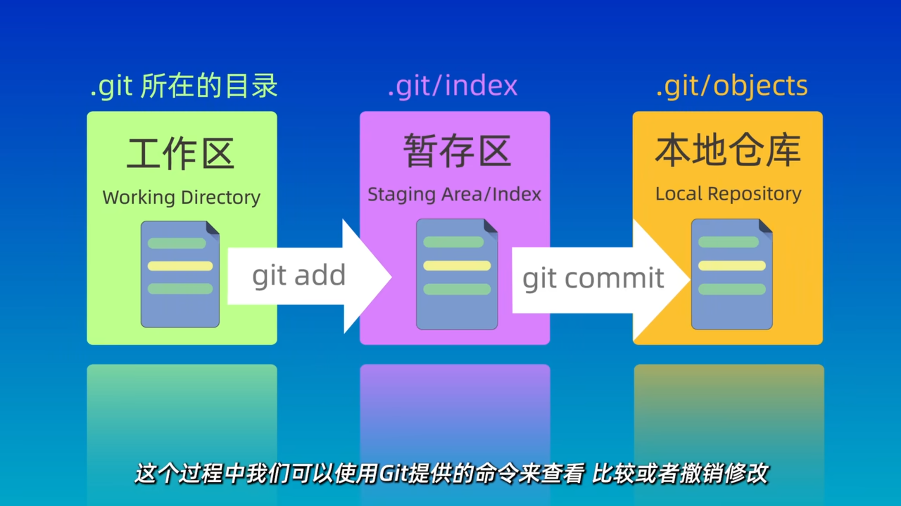

# Git Bash使用指南
[官方文档: https://git-scm.com/docs](https://git-scm.com/docs)


## 1. 配置用户名密码
**本地配置：** 只对该仓库有效
```bash
git config user.name "xx name"  # 有空格需要加""，否则不需要
git config user.email xx@xx
```

**全局配置：** 对所有仓库生效
```bash
git config --global user.name "xx name"  # 有空格需要加""，否则不需要
git config --global user.email xx@xx
```

**查看全局配置：**
```bash
git config --global --list
```

## 2. 创建仓库/pull仓库
**创建仓库：**
```bash
git init
```


**克隆仓库：**
```bash
git clone 仓库名
```
（默认clone main分支）


进入文件夹可以看到在`(main)`分支下
`git status` 看到工作区没有变化，无需提交


## 3. 在工作区工作并提交
**工作流程：**
- 在工作区增删改等
- `git add`: 把需要git的文件放入暂存区
- `git commit`: 提交修改，使用git保存
- `git push`: 同步到远程仓库



本教程展示的是使用vs code修改工作区文件的过程。
>vscode也自带git工具，详见vscode git教程：[04_VSCode](04_VSCode.md)

STEP1. 使用vscode修改工作区


可以查看一下状态：
> 可以看到有一个 "NewFile.md" 未被跟踪


STEP2. `git add` 暂存当前修改
```bash
# 暂存多个文件
git add file1 file2 dir1
# 仅暂存md文件
git add *.md
# (同上)暂存当前文件夹所有文件（包括子文件夹
git add .
# 暂存某一个文件夹所有文件
git add ./xx_dir
```

> 可以看到 "NewFile.md" 已经被放入“暂存区”，等待被提交


STEP3. `git commit` 提交该修改
```bash
git commit -m "commit msg"
```


> 注意：这时候只是commit到本地，同步到远程仓库的操作将在分支中进行介绍

**add + commit 同时操作：**
```bash
# add + commit
git commit -a -m "commit msg"
## or
git commit -am "commit msg"
```

## 4. 查看 git 历史并回退

**git reset三种模式：**

|                   cmd                   | 工作区 | 暂存区 |   补充说明   |
| :-------------------------------------: | :-: | :-: | :------: |
|           `git reset --soft`            |  ✅  |  ✅  |          |
|           `git reset --hard`            |  ❌  |  ❌  |    慎用    |
| `git reset --mixed`<br>或<br>`git reset` |  ✅  |  ❌  | 默认方式，最常用 |

### 4.1 本地分支回退 reset

STEP1. 查看 git 历史
```bash
# 查看git历史
git log
# 按 q 退出

# 简洁版log，看起来更舒适
git log --oneline
```


STEP2. 回退至某一历史 （mixed）
```bash
git reset 3b77bdf
```

使用 `git status` 查看，可以看到，该文件还在工作区，但不在暂存区了（untracked）


### 4.2 更新本地分支回退至服务器端
如果在本地回退之后，只用 `git push` 会失败，因此，只能采用更加暴力的方法↓

```bash
git push -u origin --force
```


### 4.3 恢复到 reset 之前的状态

如果。。。reset之后，后悔了怎么办？
`git reflog` 帮你找回

```bash
git reflog
```
> 看到reset前的分支


继续 git reset


## 5. 比较版本差异
可以查看工作区、暂存区、本地仓库不同分支、不同提交之间的差异等
命令：`git diff`

**工作区和本地仓库的差异：**
```bash
git diff HEAD # HEAD是该分支当前节点的指针，可以在上面的git log中看到HEAD指向哪里
```

例如，我们在vscode里修改：


在gitbash里查看差异如下：


**提交之间的差异：**
```bash
git diff 提交1 提交2
```


## 6. 分支（branch）管理
### 6.1 查看分支

**查看远程版本库名：**
```bash
git remote -v  ## 不管在哪个分支，当前分支是否在remote端，显示是一样的。origin是远程仓库的别名
```


**查看本地分支/远程分支/所有分支**
```bash
git branch      ## -- 查看本地分支
git branch -r   ## -- 查看远程分支
git branch -a   ## -- 查看所有分支
```


### 6.2 新建/切换分支

```bash
# 新建分支
git branch 新分支名

# 切换分支
git chekout 分支名
## or
git switch 分支名     ## -- 这是新版的命令，推荐！
```


### 6.3 push/pull 分支


**pull: 将远程分支拉到本地**
- pull会拉取远程的内容，并合并。如果在合并的时候发现冲突，就会pull失败
- fetch 只 获取远程仓库的内容，不合并
```bash
git pull
```


**push: 将本地push到远程服务器**
```bash
git push -u origin 分支名    ## -u 即 -upstream
```


### 6.4 合并分支
在实际工作中，很可能不同开发者分别对不同分支进行了修改。
如下图所示：`new_dev` 和 `new_branch` 是两个不同的分支，且在各自提交之后出现了分叉↓


> 注：该图是vscode使用 Git Graph 插件实现的

**git bash 查看分支图：**
```bash
git log --graph --oneline --decorate --all
```


**合并分支：**
如果想要把`分支1`合并入`分支2`
则首先进入`分支2`，使用如下命令：

```bash
git merge 分支1
```

如果这里没有填 comment，会进入VIM编辑器：
- 按 i 进入编辑
- 按 esc 退出编辑
- 按 shift+zz 退出vim

**合并分支（出现冲突）：**
如果不同分支对同一个文件进行了修改，merge的时候就会出现冲突


这里是一个冲突的例子：
>`new_branch`分支下该文件如下：
>
>
>`new_dev`分支下该文件如下：
>
>

STEP1. 查看冲突
```bash
# 查看冲突
git diff
```


STEP2. 使用VS Code等工具修改冲突后commit

**终止合并**
```bash
git merge --abort
```

### 6.5 删除分支
**删除本地分支**
```bash
# 删除已合并分支
git branch -d 分支名
# 删除未合并分支
git branch -D 分支名
```

**删除远程分支**
```bash
 git push origin :分支名
```


## 7. 如果不同开发者在同一个分支上进行操作导致冲突
强烈建议不同开发者在不同分支上进行开发，并merge到一个共同的分支上。
但是在实际中，还是会有不少小伙伴在同一个分支上开发，从而导致A commit之后，B也修改了相同的文件，无法push，pull也报错。

**示例：**
假设我们在本地和服务器的同一个文件，内容不同：


`git pull` 会报错：


**解决方法：**`git stash`

STEP1. `git stash save "描述信息"`
> `git stash` 操作将当前的工作目录恢复到干净的状态（HEAD 提交的状态），并将修改存储在一个栈（stash）中。


> 可以看到本地的修改没了，不用担心~~


STEP2. PULL


STEP3. `git stash pop`


STEP4. 修改冲突（此时就和merge的冲突是一样滴！


STEP5. ADD COMMIT （同上）