## 1. 管理仓库
点击左边的git标签即可打开Git管理GUI

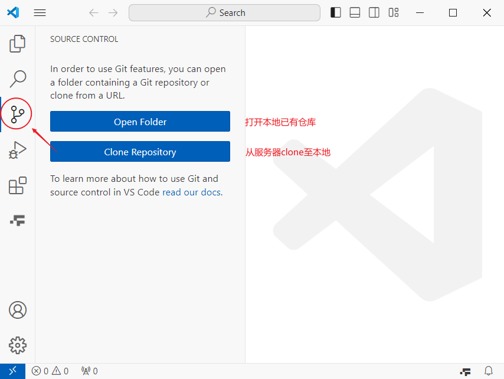

### 1.1 新建仓库

1. 在服务器端新建仓库
2. 在服务器端复制仓库HTTP地址

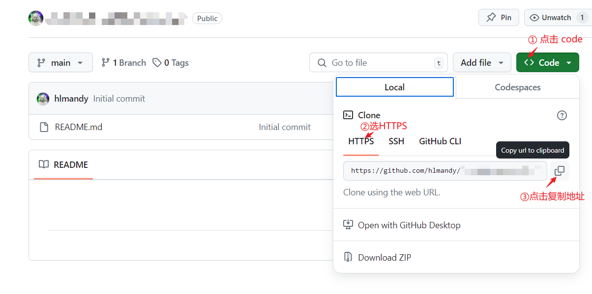

3. 克隆到本地

点击git远程仓库之后选择保存在本地的地址

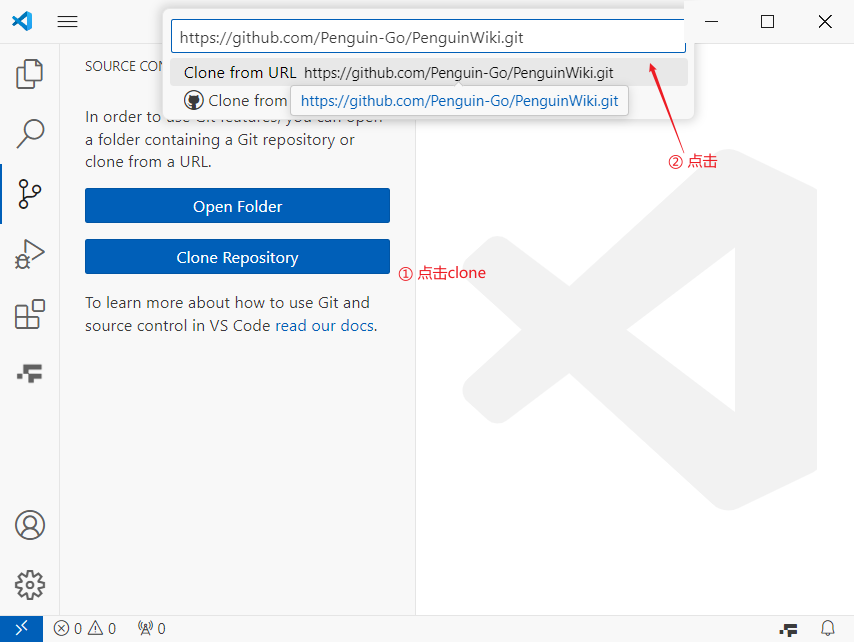

等待clone...

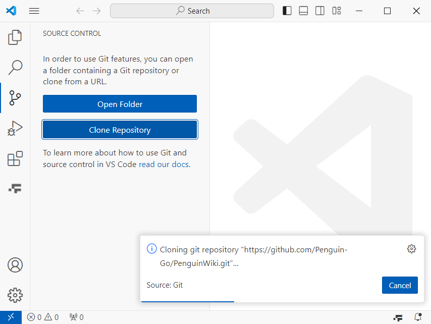

clone完成后打开：

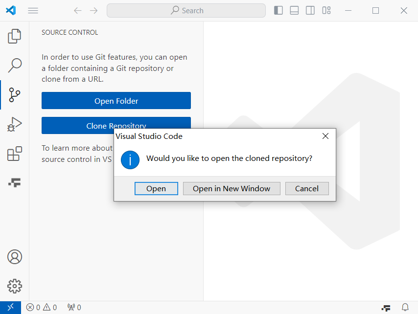

## 2. 本地工作区保存至git
### 2.1 commit

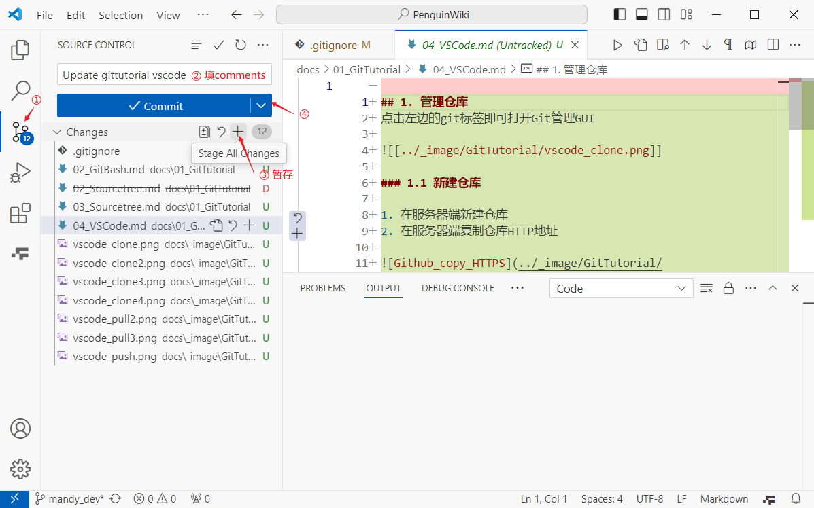

不同修改类型的标注如下：

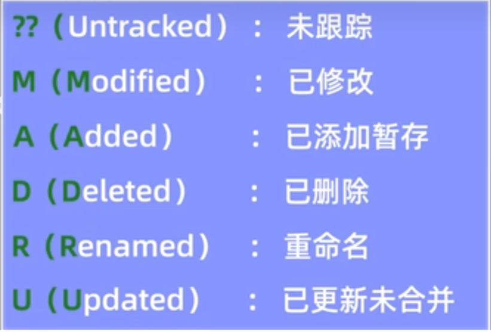

在commit前可以比较文件的diff
（这是另一个例子↓）

## 3. 本地分支与远程服务器分支的交互
### 3.1 git push

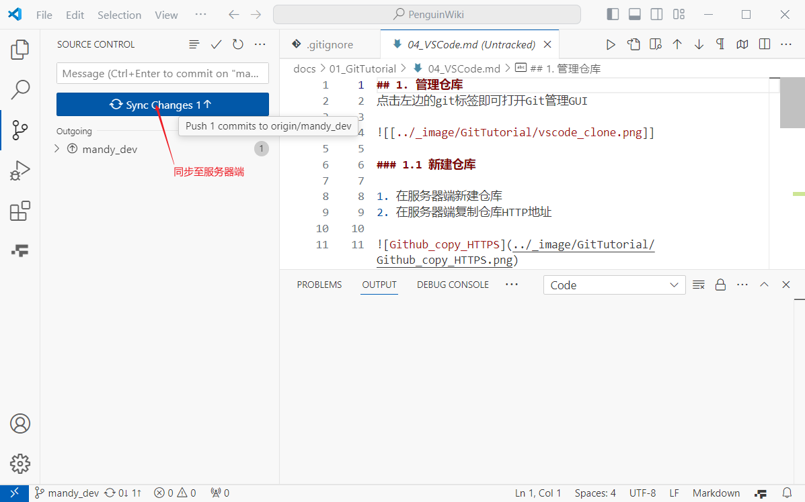

### 3.2 git pull

选择分支：
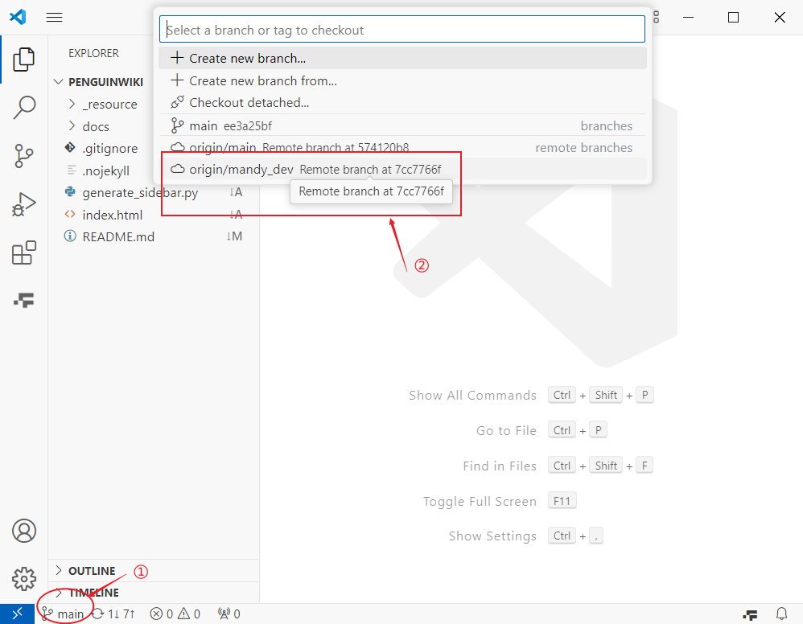

然后这个分支就在本地了
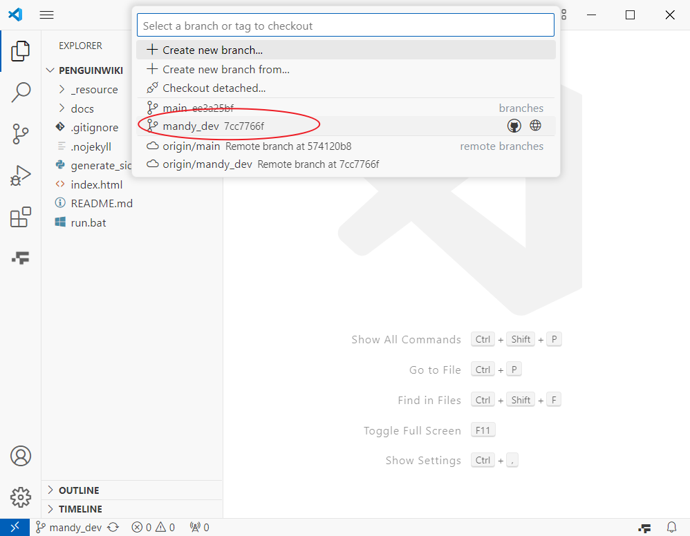

pull：
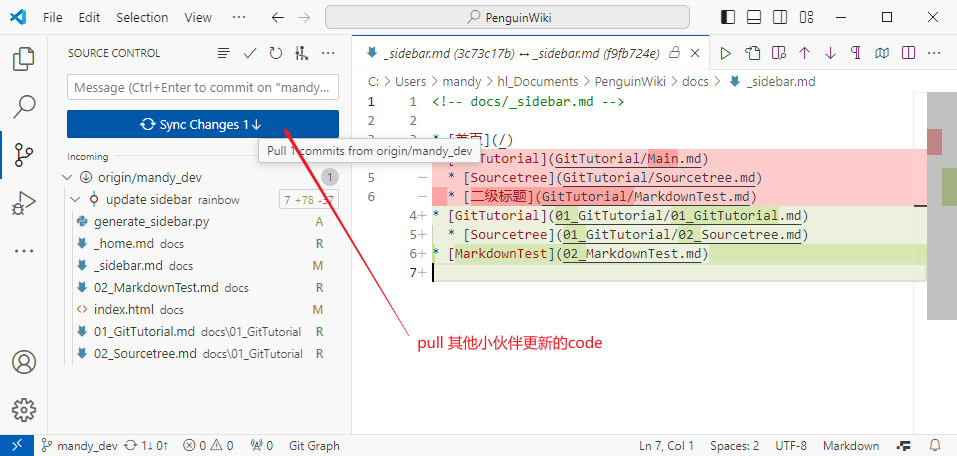

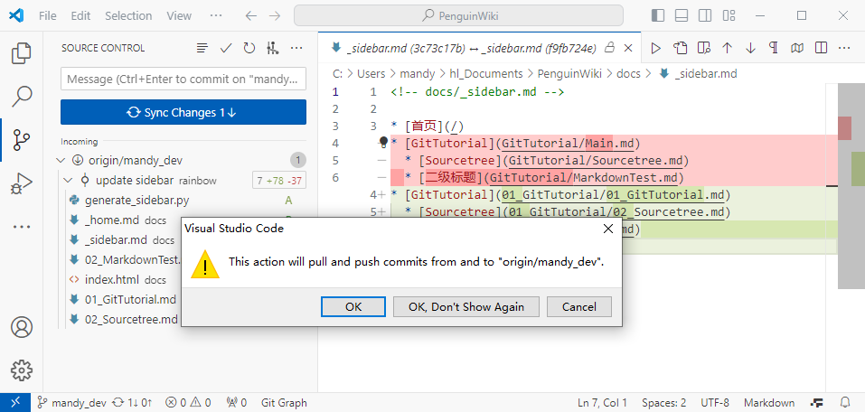

### 3.3 切换分支
以下面两个分支为例，可以看到，当切换分支的时候，本地资源管理器能看到的文件也变了。

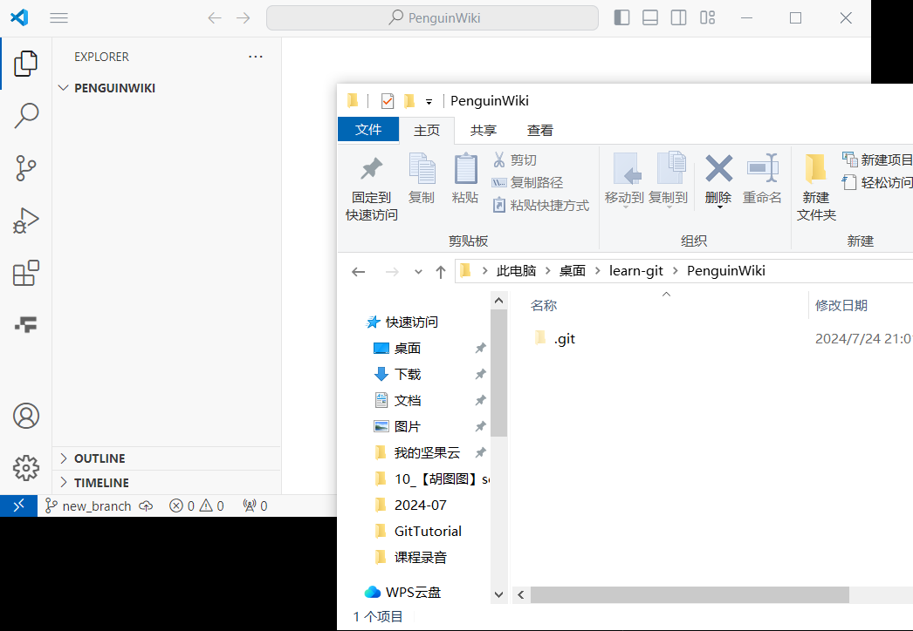

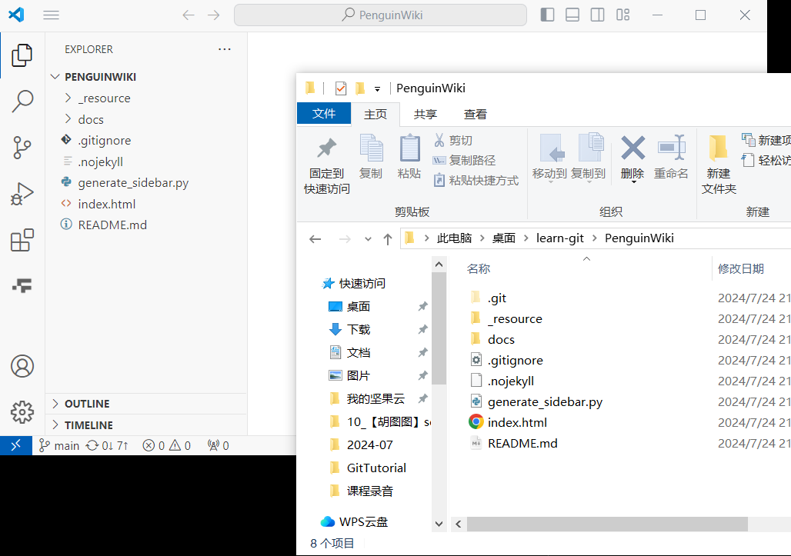

### 3.4 git merge 合并分支
如果想把new_dev合并入new_branch

1. 选择new_branch分支
2. 选择Merge...

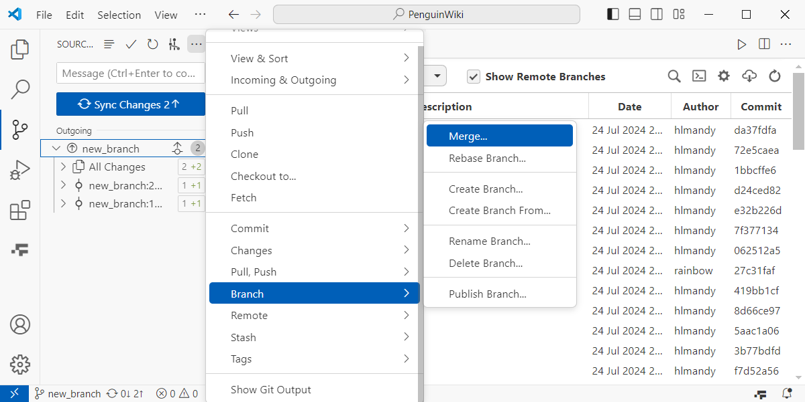

3. 选择new_dev分支

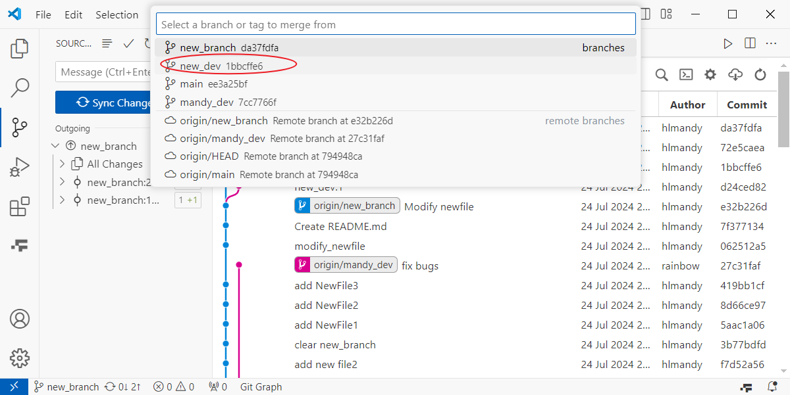

4. 合并完成

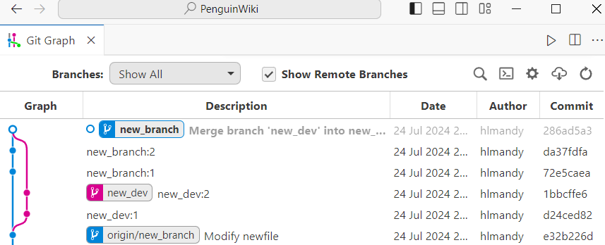

### 3.4 git merge 合并分支--分支冲突
如果merge的时候发生冲突，会出现这样的东东：

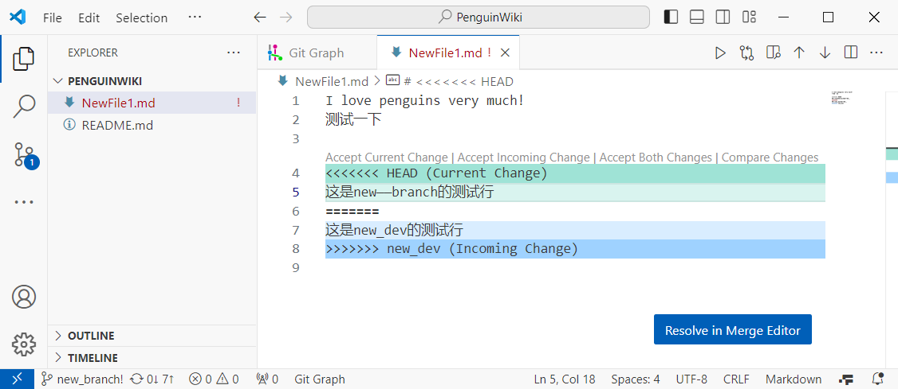

根据提示处理冲突之后，重新git add + git commit即可

## 4. 可视化插件：GitGraph

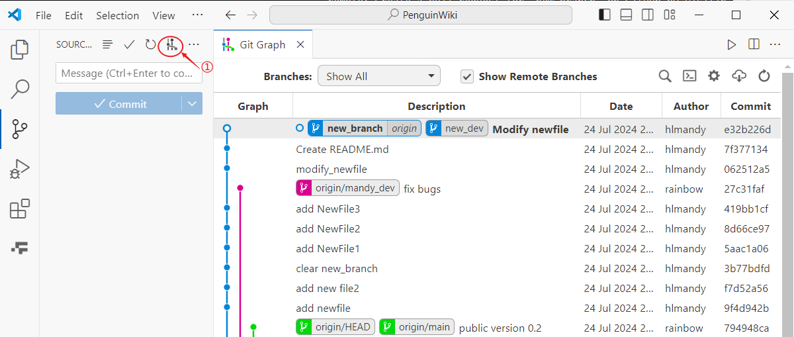

