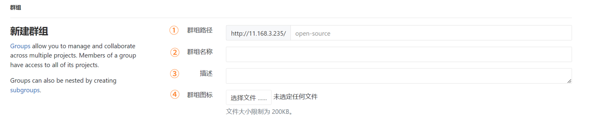
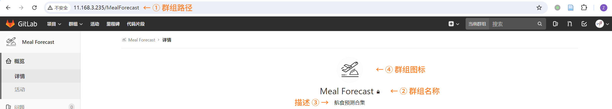
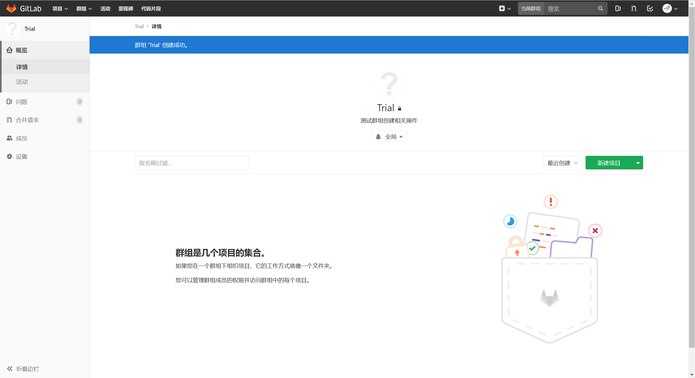
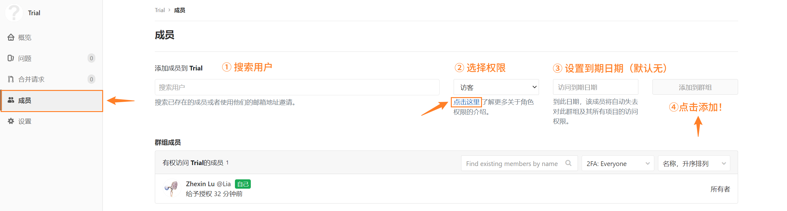
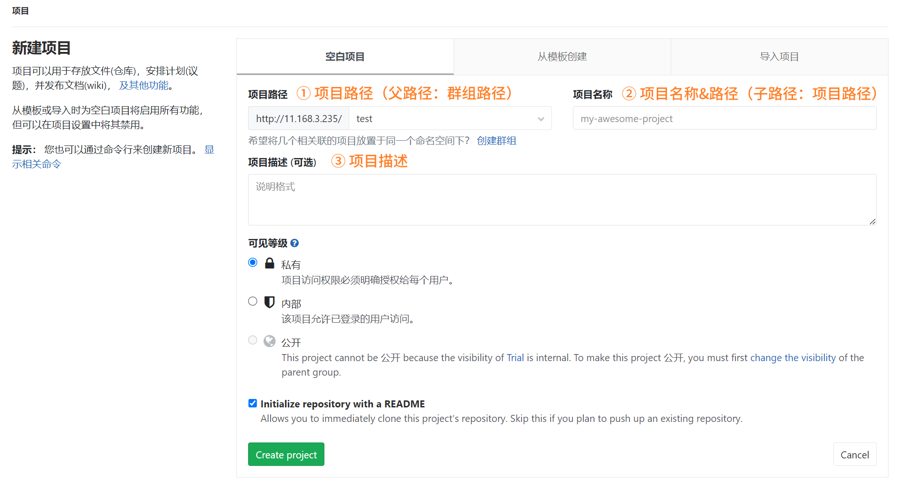
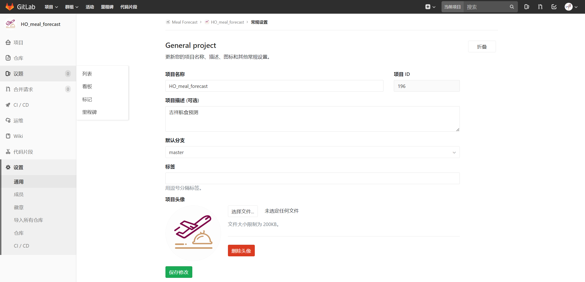
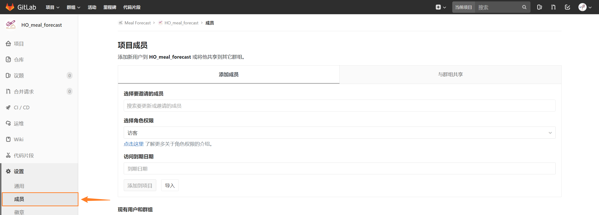

## 基础
### 背景
GitLab通常应用在企业场景内，因此为了适应业务场景，GitLab以**群组**为基础，在群组之下管理与查看项目。
### 登录
创建并登录GitLab账号（也可登录公司GitLab账号）

### 概览
GitLab的页签如下，一般来说常用的是群组和项目。

## 群组
群组一般可以理解为共同开发特定项目（组）的人员集合，即可以将经常在一起开发某类项目的人员构建为群组，并在群组下管理项目。
### 新建群组
点击新建群组（绿色按钮）：

#### 基础设置
基础设置及最终出现结果如下图组所示，释义如下：
- 群组路径：最后会出现在url里的名称，建议采用驼峰命名
- 群组名称&描述：按实际情况填写即可
- 群组头像：可以设置，置之不理则会以**群组名称的第一个字**作为头像（如Recovery为R）

#### 群组可见等级
可见等级有三级：
- 私有（private）：默认只有所有者可见，创建完毕后可通过[修改成员权限实现指定成员可见](#成员权限)，**推荐采用这一方式**
- 内部（interval）：默认所有登录用户可见
- 公开（public）：默认所有用户（包括游客）可见

在设置完上述所有属性后，即可点击“创建群组”，得到如下图所示页面：

### 修改群组设置
#### 基本修改
在创建群组时所提到的所有属性均可在`设置`中进行修改：

>[!WARNING|style:flat]
>如果修改了群组路径，一定要及时更新所有该群组下的本地项目的远程仓库路径！
#### 成员权限
成员权限共有五种，简要释义如下：

|  名称  |    英文名称    |     可为     |    不可为     |  建议设置  |
| :--: | :--------: | :--------: | :--------: | :----: |
| 所有者  |   Owner    |    all     |     -      |  创建者   |
| 主程序员 | Maintainer | almost all | 所有涉及到警告的操作 | 共同开发成员 |
| 开发人员 | Developer  |    修改代码    | 和项目属性相关的操作 | 共同开发成员 |
| 报告者  |  Reporter  |    克隆代码    |    修改代码    |   -    |
|  访客  |   Guest    | 创建问题、发表评论  | 和代码相关的任何操作 |   默认   |

如有疑问可以直接查看GitLab在成员权限下方的链接，具体修改操作如下：
1. 搜索用户
2. 选择用户权限（说明见上）
3. 设置到期日期（默认无）
4. 点击`添加到群组`，完成设置

## 项目
除了个人项目外，绝大多数项目都依托群组进行管理。
### 新建项目
一共有两个入口：
- 项目-新建项目

- 已创建群组-新建项目

#### 基础设置
基础设置及最终出现结果如下图组所示，释义如下：
- 项目（群组）路径：最后会出现在url里的父路径，**仅能选择User或者Group，Group即用户已创建的全部群组**
- 项目名称：最后会出现在url里的子路径，也会出现在项目名称处
- 项目描述：按实际情况填写即可

>[!tip|style:flat]
>**项目名称就是子路径名称！！**
>如果不喜欢项目名称与子路径名称一致，建议在创建项目时优先设置子路径名称，并之后在项目设置内修改项目名称。

#### 项目可见等级
项目可见等级设置类似[群组可见等级设置](#群组可见等级)，但需要注意的是，**项目可见等级受群组可见等级限制**。
>[!NOTE|style:flat]
>项目权限继承群组权限，继承时项目的权限限制为：
> - 群组公有（public）→项目公有、内部、私有
> - 群组内部（interval）→项目内部、私有
> - 群组私有（private）→项目私有

在填写完相应的项目属性后，可以勾选`Initialize repository with a README`，即在创建项目时带上README.md作为说明，即可完成项目构建。
### 修改项目设置
#### 基本修改
类似[群组基本修改](#基本修改)，不同的是：
- 此处项目名称仅为名称修改，不涉及到项目路径
- 可以修改项目头像

#### 成员权限
类似[群组成员权限设置](#成员权限)，如果希望更新项目成员权限，可以采取和添加同样的方式实现更新：
