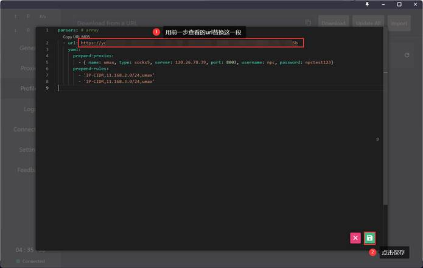
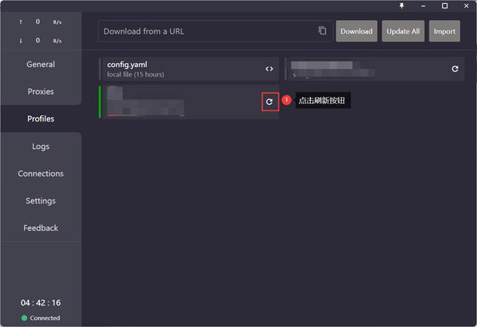
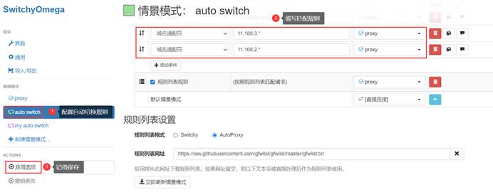

# 配置自定义代理

## 为什么需要配置自定义代理？

如果你除了科学上网还有一些别的代理需求，比如需要连接公司内网，且觉得分别操作和开关两个代理比较麻烦，你可以尝试将其他代理也配置在Clash中。

## 配置方法

### Step0：查看订阅链接（如果知道订阅链接，可以跳过这一步）


复制URL框里的订阅链接


### Step1：修改Parsers


粘贴下面这段代码（注意用Step0中查看到的订阅链接替换这里的订阅链接），保存退出：
```yaml
parsers: # array 
- url: https://xxxxx(替换为你的机场订阅链接) 
  yaml: 
  	prepend-proxies:
  	 	- { name: UMAX, type: socks5, server: 120.26.78.39, port: 8003, username: npc(替换为VPN帐号名), password: npctest123(替换为VPN密码)} 
	prepend-rules: 
	 	- 'IP-CIDR,11.168.2.0/24,UMAX' 
	 	- 'IP-CIDR,11.168.3.0/24,UMAX'
```



### Step2：刷新订阅链接

如果没报错的话就是搞定了！



### Step3：设置Proxy SwitchyOmega自动切换

Tips：如果之前没用过Proxy SwitchyOmega请先去看“新用户偷懒指南”进行基础配置！

打开浏览器，打开Proxy SwitchyOmega的配置页面


根据下图进行配置：

