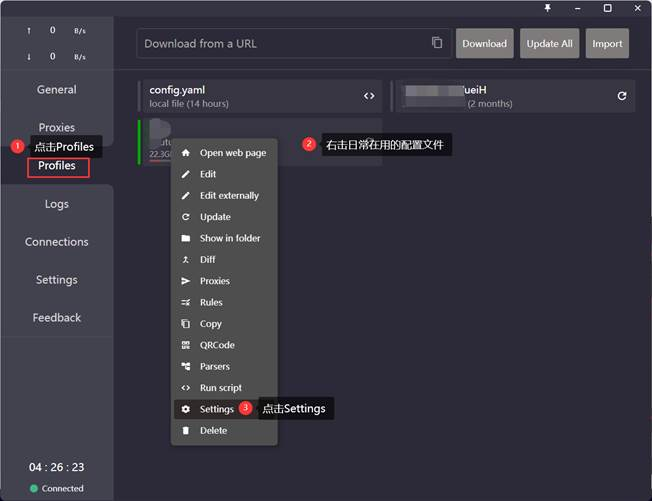
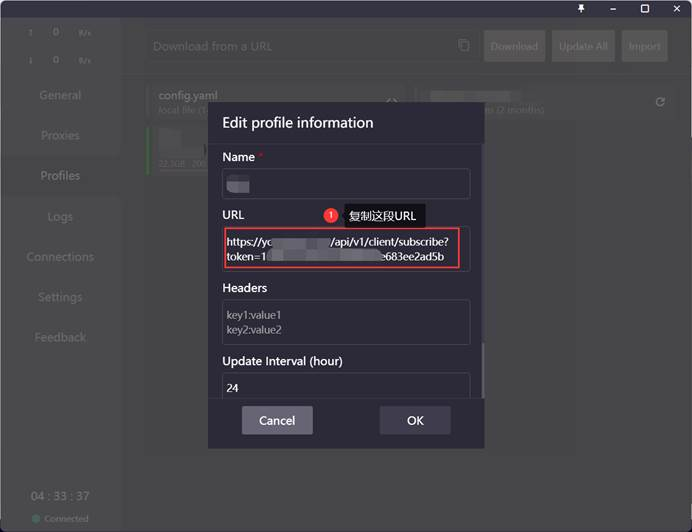
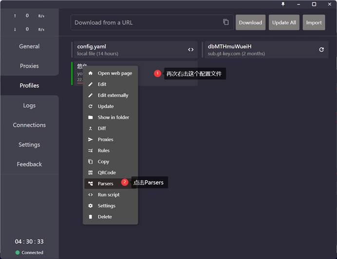
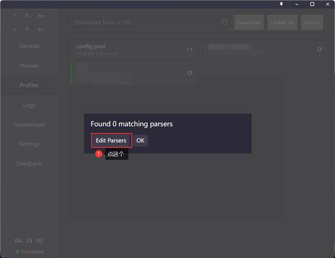
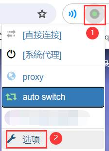

# 配置自定义代理

## 为什么需要配置自定义代理？

如果你除了科学上网还有一些别的代理需求，比如需要连接公司内网，且觉得分别操作和开关两个代理比较麻烦，你可以尝试将其他代理也配置在Clash中。

## 配置方法

### Step0：查看订阅链接（如果知道订阅链接，可以跳过这一步）



复制URL框里的订阅链接



### Step1：修改Parsers





粘贴下面这段代码（注意用Step0中查看到的订阅链接替换这里的订阅链接），保存退出：

```yaml
parsers: # array 
- url: https://xxxxx(替换为你的机场订阅链接) 
  yaml: 
  	prepend-proxies:
  	 	- { name: 【代理名称】, type: socks5, server: 【代理服务器地址】, port: 【端口】, username: 【代理账号】, password: 【代理密码】} 
	prepend-rules: 
	 	- 'IP-CIDR,【IP规则1】,【代理名称】' 
	 	- 'IP-CIDR,【IP规则2】,【代理名称】'
```


  
> [!TIP]  
> IP规则的书写方式可以在 [Rules 规则 | Clash](https://a76yyyy.github.io/clash/zh_CN/configuration/rules.html#ip-cidr-ipv4%E5%9C%B0%E5%9D%80%E6%AE%B5) 进行查看；
> 当然，转发规则不一定是IP规则，也可以是其他类型的规则，这些规则的书写方式也可以在 [Rules 规则 | Clash](https://a76yyyy.github.io/clash/zh_CN/configuration/rules.html) 进行查看。


### Step2：刷新订阅链接

如果没报错的话就是搞定了！


### Step3：设置Proxy SwitchyOmega自动切换


> [!TIP]
> 如果没有安装或正确配置Proxy SwitchyOmega请先查看[配置SwitchyOmega](02_配置SwitchyOmega.md)进行基础配置！

打开浏览器，打开Proxy SwitchyOmega的配置页面



根据下图，输入相关IP规则（或其他规则）进行配置：


这样，访问内网网页就可以自动转发至代理，无需手动开关系统代理。