## 前言

### 背景

多数航司的EasyConnect无法同时在电脑上共存，且高版本无法兼容低版本（如7.6.7无法兼容7.6.3），且登录VPN强制检测是否存在对应版本客户端（若不存在则强制安装），对乙方极其不友好。

这一情况导致如果同时进行多个航司的项目，无法实现VPN的并行，即无法无痛在各个航司项目间切换，导致极高的项目切换成本。

由EasyConnect能否同时存在多版本这一问题，想到通过容器or镜像控制不同版本的EasyConnect，达到启动对应容器，通过使不同访问链接走不同端口的方式连接不同VPN，达到同时开启多航司的VPN的效果，实现项目并行开发。

本方法的实现离不开docker-easyconnect这一项目，项目github地址如下：
https://github.com/docker-easyconnect/docker-easyconnect

> 笔者实测，吉祥（7.6.7）和川航（7.6.3）的VPN能够同时运行。

### 前置条件

#### 电脑配置

- 内存容量：docker运行后大约需要2G内存，确保电脑内存有余裕
- 系统版本：为运行WSL2，根据官网，Windows系统版本应满足下图要求：
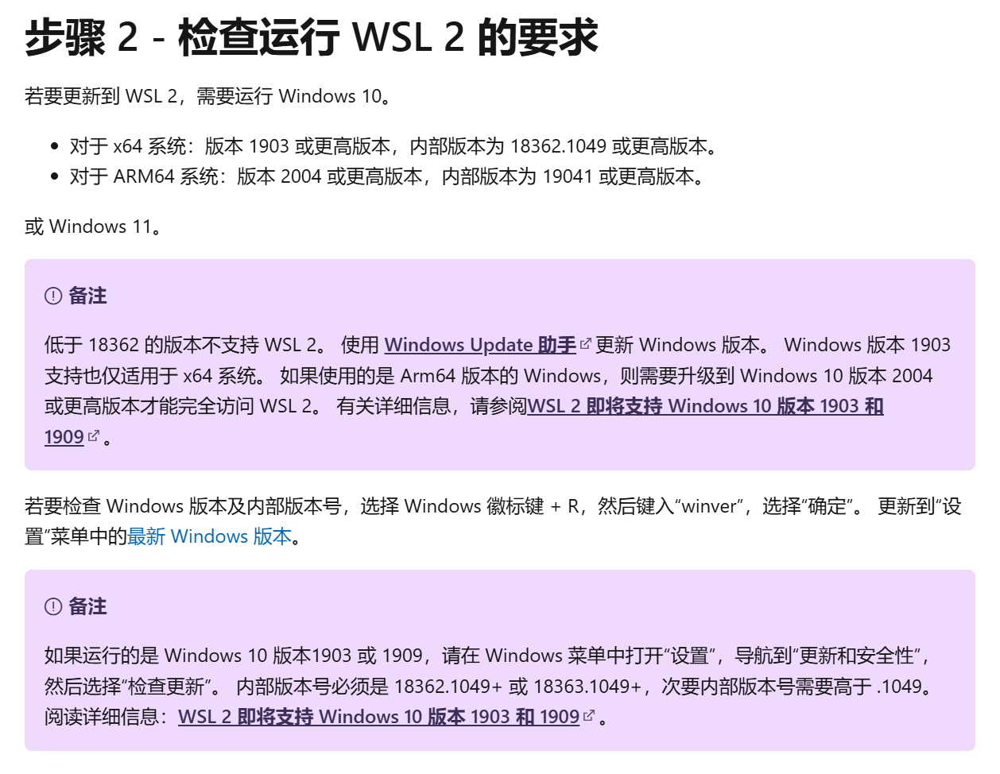

#### 需要软件及插件

| 软件/插件           | 用途                         |
| :-------------- | :------------------------- |
| Clash           | 梯子APP，识别需VPN代理非浏览器连接（如数据库） |
| SwitchyOmega    | Chrome插件，识别需VPN代理浏览器连接     |
| WSL2            | Windows内置的Linux子系统         |
| Docker Desktop  | 构建容器                       |
| TigerVNC Viewer | 图形化界面                      |

## 步骤

### 1. 安装WSL2

安装流程见：
https://blog.csdn.net/u011119817/article/details/130745551

修改root密码和更改默认登录用户可以参考：
https://blog.csdn.net/weixin_43408232/article/details/128606034

### 2. 安装Docker Desktop

下载链接：
https://docs.docker.com/desktop/setup/install/windows-install/

> 以Windows11家庭版23H2为例，点击Docker Desktop for Windows - x86_64

### 3. 安装VNC

下载链接：
https://sourceforge.net/projects/tigervnc/files/stable/1.14.1/

> 点击 tigervnc64-1.14.1.exe

### 4. 启动docker

打开Docker Desktop的Terminal：

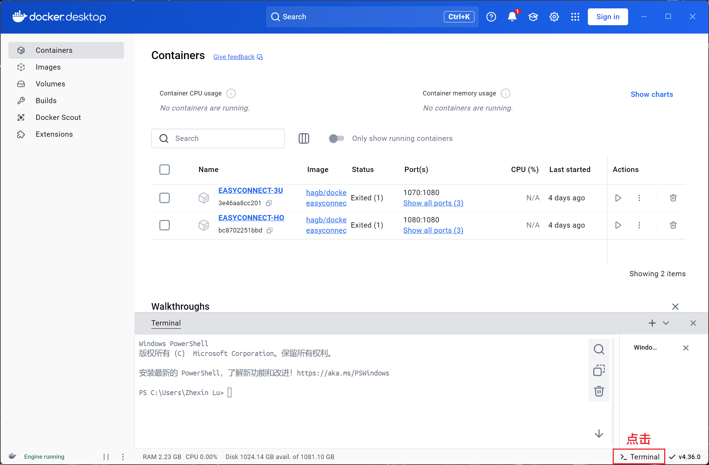

在Terminal输入如下内容，其中[]为自定义内容，**建议自定义容器名与航司有关，便于识别容器承载哪个航司的VPN**

```docker
docker run --name [自定义容器名] --device /dev/net/tun --cap-add NET_ADMIN -ti -e PASSWORD=[自定义密码] -e URLWIN=1 -p 127.0.0.1:[自定义映射端口]:5901 -p 127.0.0.1:[自定义socks5端口]:1080 -p 127.0.0.1:[自定义http端口]:8888 hagb/docker-easyconnect:[自定义版本]
```

> [!Note]
> EasyConnect自定义版本一般有两种选择：
> - 7.6.7（如吉祥）
> - 7.6.3（如川航）

### 5.通过TigerVNC Viewer登录VPN

启动docker如图：

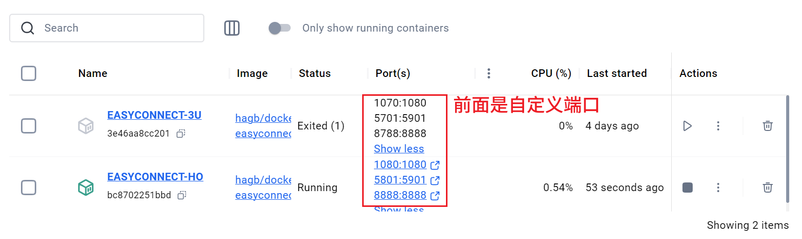

打开TigerVNCViewer，输入对应端口号（127.0.0.1:\[自定义映射端口\]），点击【连接】：

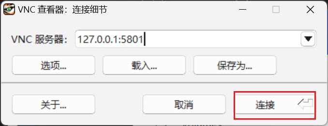

填写自定义密码，点击【确定】：

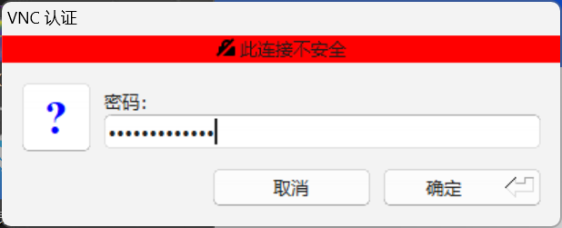

之后按照正常VPN登录流程即可，如吉祥登录界面如下图，注意勾选“记住我”：

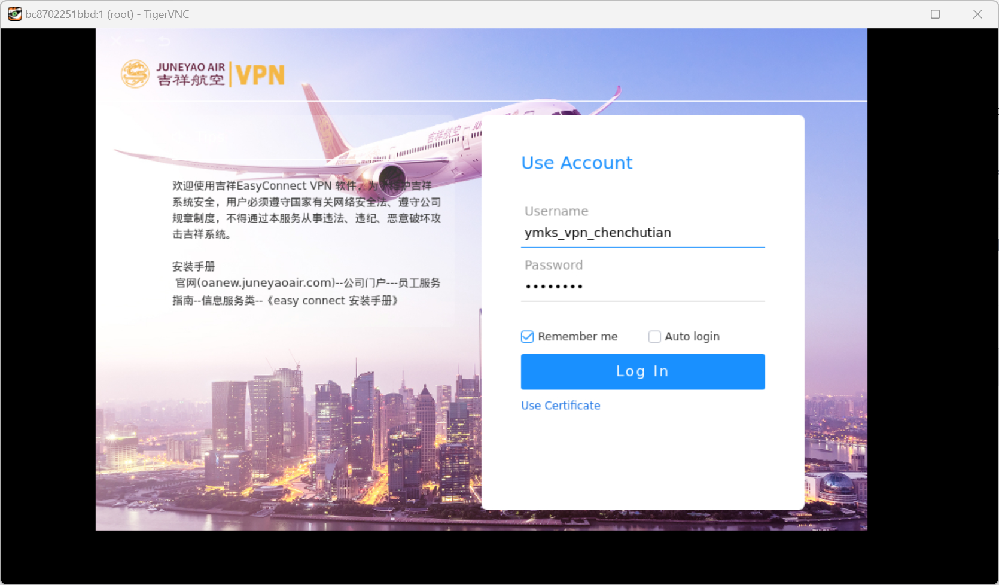

### 6. 设置代理

以上步骤完成了VPN登录，确保能够同时启用多个航司不同版本的EASYCONNECT，但是尚未实现访问对应链接时通过对应VPN，以下步骤主要为了解决上述问题。

本步骤前置阅读：
https://righteous-kale-0c7.notion.site/Clash-2530ee05e78249dda17687ec6b833525

#### 其他代理：Clash

如果已执行完前置阅读中的步骤，正常应该拥有一条对应订阅链接的预处理配置，可以点击预处理配置查看：

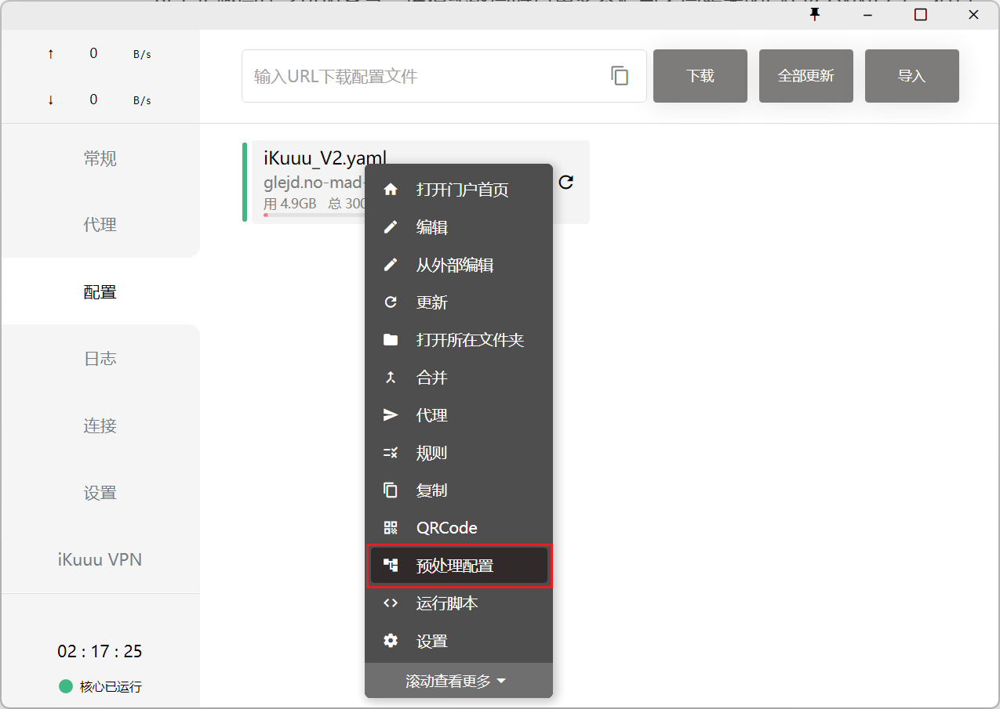

点击后，可以保留原公司内网访问预处理配置，仅需新增prepend-proxies（代理）和prepend-rules（需要走对应代理）内容，以川航和吉祥为例：

```
parsers: # array
- url: [订阅链接]
  yaml:
    prepend-proxies:
      - { name: HO, type: socks5, server: 127.0.0.1, port: 1080}
      - { name: 3U, type: socks5, server: 127.0.0.1, port: 1070}
      - { name: [自定义proxy名], type: sockes5, server: 127.0.0.1, port:[自定义socks5端口]}
    prepend-rules:
      - 'IP-CIDR,172.22.33.0/24,HO'
      - 'IP-CIDR,172.31.8.0/24,3U'
      - 'IP-CIDR,[需要转接的IP],[自定义proxy名]'
```

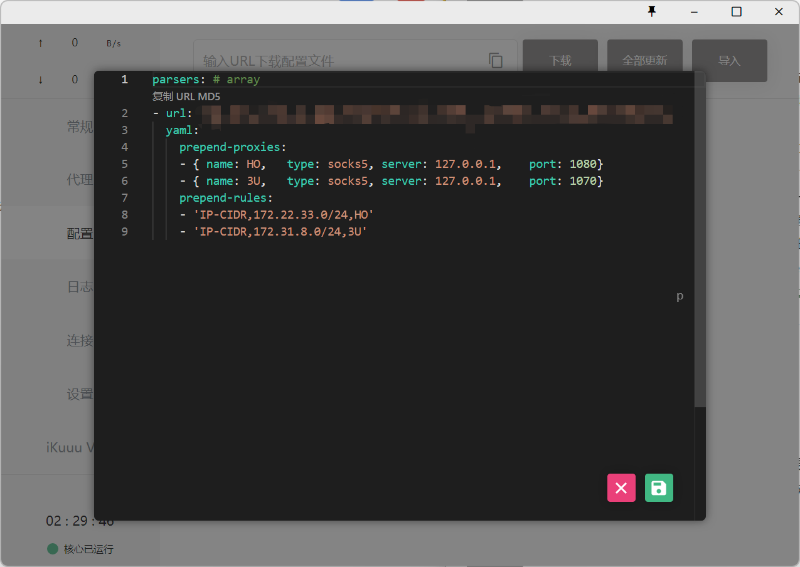

**打开Clash的TUN模式（确保所有访问能够被对应端口代理），选择任意写在预处理配置中的链接测试连接情况**，TUN模式开启方式如下：

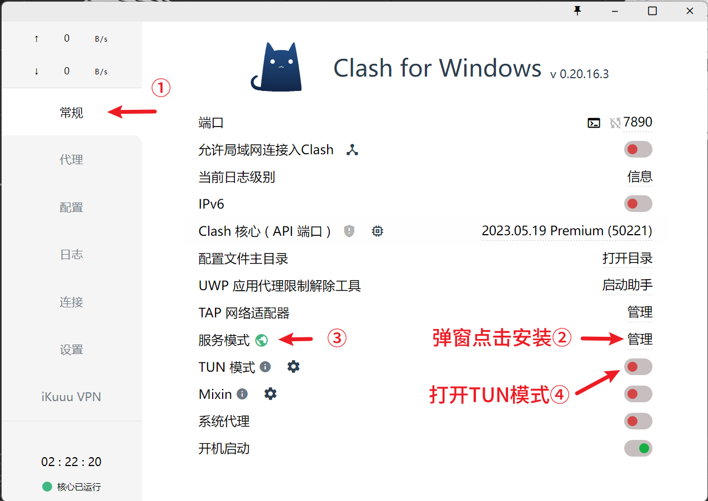

#### 浏览器代理：Switchy Omega

如果已执行完前置阅读中的步骤，正常应该拥有公司内网代理和梯子代理，则直接从设置EasyConnect相关代理开始。

首先，打开SwitchyOmega设置界面，为对应航司设置新情景模式：

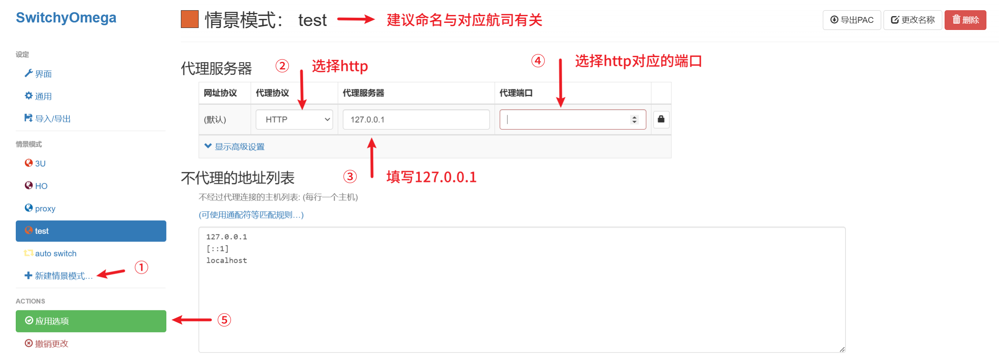

其次，打开auto switch情景模式，新增域名通配符和情景连接关联：

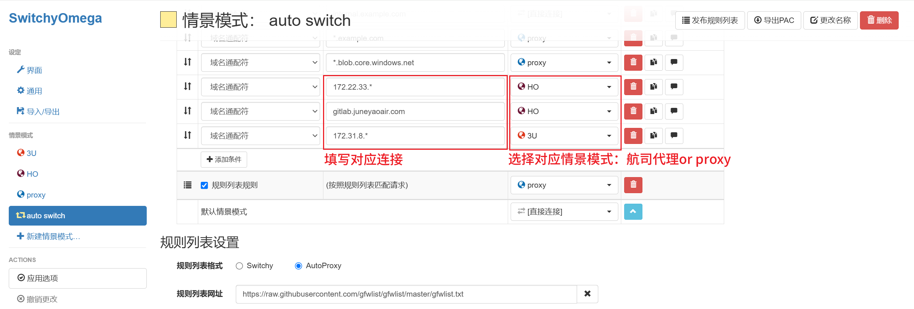

**如果选择proxy，确保Clash开了TUN模式之后能够丝滑转接对应浏览器连接至对应端口，如果测试下来不能实现，建议选择新增的情景模式。**

## 总结

### 最后操作

在全部进行完上述设置，测试无误后，此后启动VPN无需重新安装版本，即可畅连全部使用EasyConnect的公司；如果电脑内存允许，可以同时共存多个航司的VPN。共计需进行以下操作：
1. 启动Docker Desktop
2. 点击启动对应航司容器
3. 启动TigerVNC Viewer，输入对应端口号（127.0.0.1:\[自定义端口\])和密码
4. 连接对应航司VPN
5. Clash开启TUN模式

### 缺陷

实际上，由于github项目的技术限制，本项目仍存在以下遗憾无法实现：
- 由于缺少x86架构下的aTrust，所以VPN母版为aTrust的无法使用容器，仍需下载对应客户端并启动。
